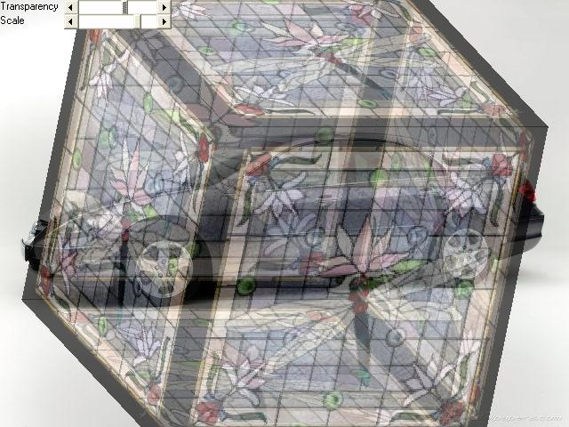



## EGL\_GlassCube

### Description

this is a final project. 3d transparent material texture.No DX,GL.
 
### More Info
 
Public Declare Function GetDIBits Lib "gdi32" (ByVal aHDC As Long, ByVal hBitmap As Long, ByVal nStartScan As Long, ByVal nNumScans As Long, lpBits As Any, lpBI As BITMAPINFO, ByVal wUsage As Long) As Long

Public Declare Function SetDIBits Lib "gdi32" (ByVal hdc As Long, ByVal hBitmap As Long, ByVal nStartScan As Long, ByVal nNumScans As Long, lpBits As Any, lpBI As BITMAPINFO, ByVal wUsage As Long) As Long

             |
---                |---
**Submitted On**   |2008-10-13 14:37:52
**By**             |[Erkan Sanli](https://github.com/Planet-Source-Code/PSCIndex/blob/master/ByAuthor/erkan-sanli.md)
**Level**          |Intermediate
**User Rating**    |4.9 (39 globes from 8 users)
**Compatibility**  |VB 4\.0 \(32\-bit\), VB 5\.0, VB 6\.0
**Category**       |[Graphics](https://github.com/Planet-Source-Code/PSCIndex/blob/master/ByCategory/graphics__1-46.md)
**World**          |[Visual Basic](https://github.com/Planet-Source-Code/PSCIndex/blob/master/ByWorld/visual-basic.md)
**Archive File**   |[EGL\_GlassC21304910142008\.zip](https://github.com/Planet-Source-Code/erkan-sanli-egl-glasscube__1-71230/archive/master.zip)

